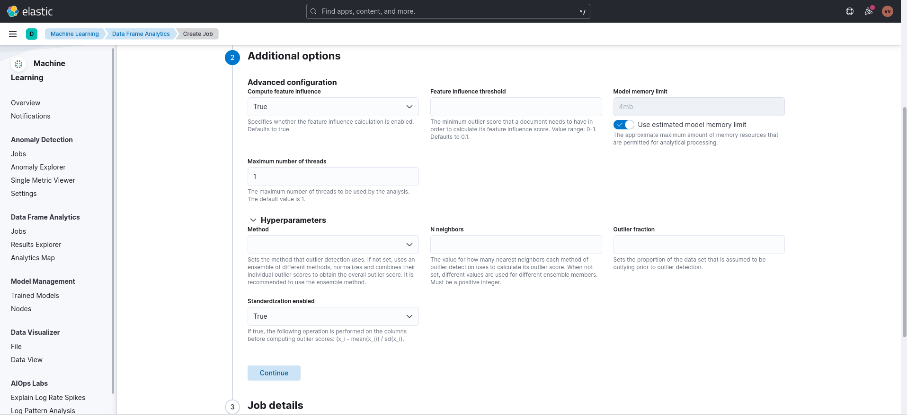
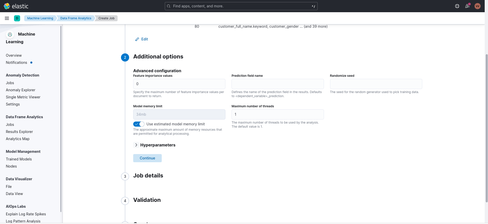
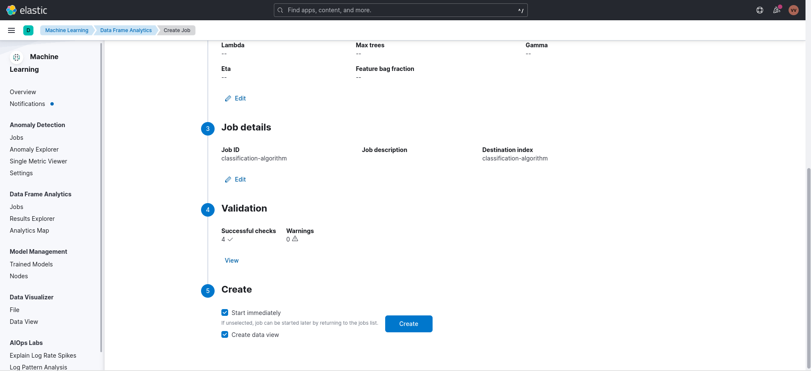

### Elastic Machine Learning Demo - Global AI Bootcamp Meetup

##### Presenting by Veerasolaiyappan - Fullstack developer


#### Prequestics

**Elastic cloud Account**

```
https://cloud.elastic.co/registration

```

##### step 1 : Sign up for an Elastic Cloud account

If you don't already have an Elastic Cloud account, sign up for one on the Elastic Cloud website.

###### Account creation 


###### login


##### step 2 : Create an Elasticsearch cluster

In the Elastic Cloud console, create an Elasticsearch cluster. You can choose the size, location, and other parameters of your cluster based on your needs and budget


###### Create deployment


###### Machine learning node Autoscaling configuration


###### Deployment completion


##### step 3 : Enable machine learning

Once your Elasticsearch cluster is created, you can enable machine learning by going to the Kibana tab in the Elastic Cloud console and clicking on the "Machine Learning" button


###### Kibana Dashboard 


###### Machine learning section


##### step 4 : Ingest sample data

Elastic Cloud provides sample data sets that you can use to test and demonstrate the capabilities of Elastic machine learning. In Kibana, go to the "Machine Learning" tab, click on "Data Visualizer", and select "Sample data" to ingest a sample data set.


###### View all sample dataset


###### Select Ecommerce sample dataset


### Usecase 1 : Anomaly Detection 


##### step 1 : Create an anomaly detection job

 In Kibana, create an anomaly detection job using the sample data set by specifying the data source, selecting the machine learning algorithm, and setting the analysis parameters

###### Create job


###### View job


##### step 2 : Train the model

Once the anomaly detection job is configured, train the machine learning model on the sample data set.


###### Train job


##### step 3 : Review the results

After the model is trained, review the results in Kibana. The anomaly detection job will flag any data points that are considered anomalous based on the model's analysis.


###### Anomaly detection details


##### step 4 : Take action

Finally, take action on the anomalous data points, such as investigating the root cause of the anomaly, alerting stakeholders, or triggering automated responses.


### Dataframe analytics

###### Create Dataframe analytic job


###### Select ML algorithm 


### Usecase 2 : Outliner Detection 

Outlier detection is a type of machine learning algorithm that is used to identify observations in a dataset that deviate significantly from the rest of the data. Outliers are data points that are significantly different from the other observations and may indicate errors or anomalies in the data.

###### Select Outliner algorithm 


###### Scatterplot matrix


###### Advanced options




###### Job Details


###### Validate & create job


###### View result


### Usecase 3 : Regression

Regression is a type of supervised learning algorithm in machine learning that is used for predicting continuous numerical values based on a set of input features. It is a statistical method that seeks to model the relationship between a dependent variable (also called the target variable) and one or more independent variables (also called the predictor variables).

###### Select Regression algorithm 


###### Scatterplot matrix


###### Advanced options




###### Job Details


###### Validate & create job


###### View result


### Usecase 4 : Classification


Classification is a type of supervised learning algorithm in machine learning that is used for predicting categorical values based on a set of input features. It is a method that seeks to learn a decision boundary between different classes of data.

###### Select Regression algorithm 


###### Scatterplot matrix


###### Advanced options


###### Job Details


###### Validate & create job




###### View result


