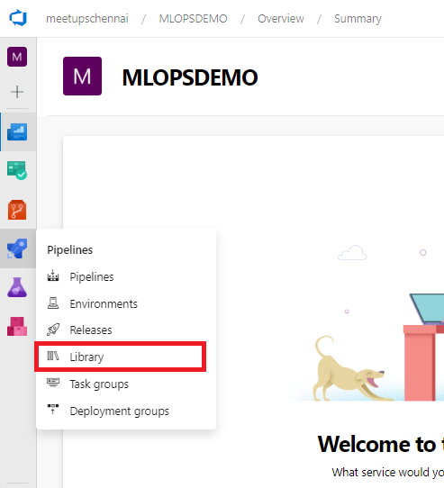
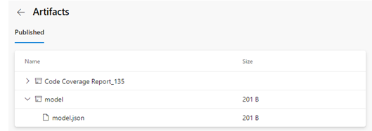

# About me

# MLOPS AzureMachineLearning

- **MLOps** helps us to understand how to build a Continuous Integration and Continuous Delivery pipeline for an ML/AI project.

- Let us use the Azure DevOps Project for build and release/deployment pipelines along with Azure ML services for model retraining pipeline, model management and operationalization.

# PREREQUISITE:
- •	Active Azure subscription
- •	At least contributor access to Azure subscription

> In this example, we are using a sample ML project diabetes_regression to set up MLOPSPython. The project creates a linear regression model to predict diabetes and has CI/CD DevOps practices enabled for model training and serving.

- For the purpose of demo, I am using a “Pay as you go” subscription model of azure to be able to run CI/CD jobs.

## STEP1: CREATION OF AZURE ACCOUNT

- For details on how to create an azure account please use the link below
- https://azure.microsoft.com/en-in/free/ 

## STEP2: CREATION OF DEVOPS ORGANIZATION

- To create an Azure DevOps organization, please refer to 
- https://learn.microsoft.com/en-us/azure/devops/organizations/accounts/create-organization?view=azure-devops

## STEP3: CREATION OF PROJECT IN AZURE DEVOPS

- (i)	Navigate to Azure DevOps Organization, Click on “New Project” 

- (ii)	Enter the name of the project, click create

> Now we have the Azure DevOps Project Created.  

## Install the Azure Machine Learning extension

> Install the Azure Machine Learning extension to your Azure DevOps organization from the Visual Studio Marketplace by clicking "Get it free" and following the steps. The UI will tell you if try to add it and it's already installed.

> This extension contains the Azure ML pipeline tasks and adds the ability to create Azure ML Workspace service connections.

> Click on it --> Go to “Browse Marketplace” --> search for “Machine Learning Extension”

> Once it is installed, go back to the project that has been created and navigate to 

> Pipelines --> Library --> Create Variable Group

- Create a Variable Group for your Pipeline:
- Create a variable group named devopsforai-aml-vg. The YAML pipeline definitions in this repository refer to this variable group by name.

- The variable group should contain the following required variables. 

> While trying to add service connection, we will be asked to authenticate using the azure account.

> Having done that, run the pipeline: - this should create a resource group, a Key Vault, a Storage Account, a Container Registry, an Application Insights and a Machine Learning workspace.

> Once the build job is successful, Check on the resources created via Azure portal.

> Great, you now have the build pipeline for training set up which automatically triggers every time there's a change in the master branch!

> After the pipeline is finished, you'll also see a new model in the AML Workspace model registry section:

